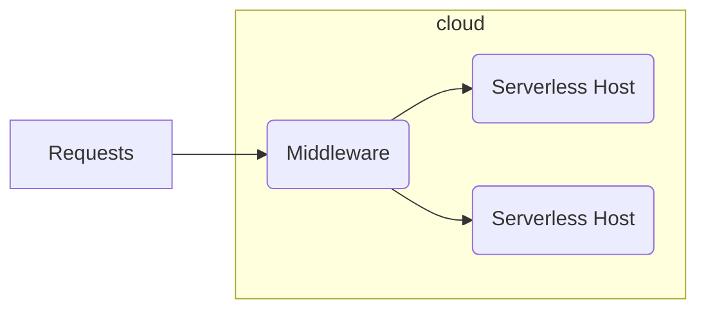
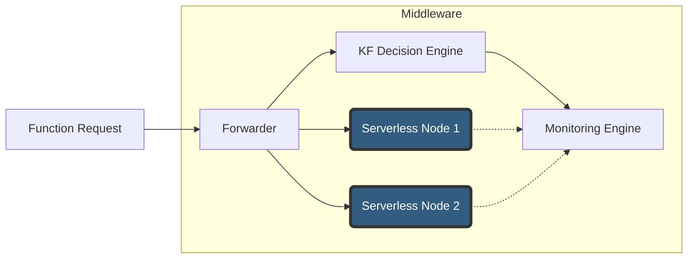
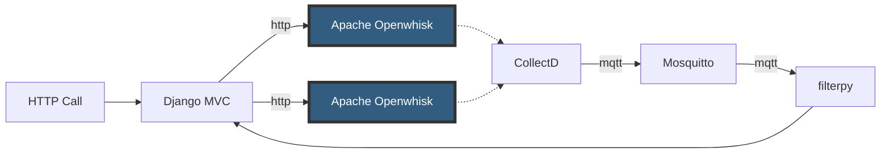
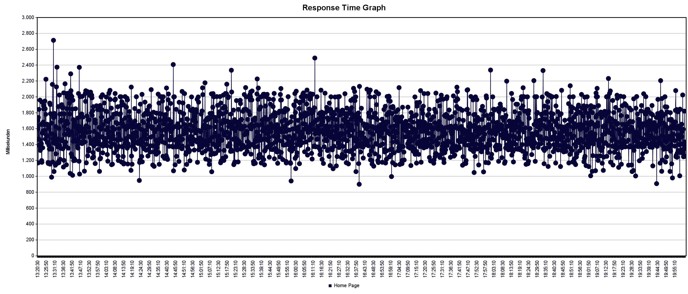
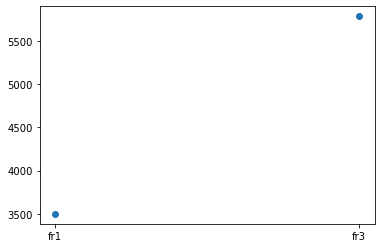
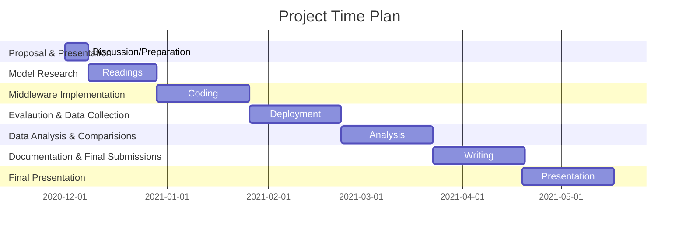

# Smart function placement for serverless applications

Author: Sanjeet Raj Pandey <br>
Supervised By: Maria <br>
Department: SNET, TU-Berlin

## Introduction 

This is code base for serverless middleware system. The system uses Kalman Filter to decide the placement call of the
function. To do such redirection, some data is needed such as host list that has function installed.


[[_TOC_]]


## System Architecture



A middleware should run on any linux based system that support python runtime. Middleware is responsible for selection
of a serverless node from a cluster and forware request. Response is then forwarded back to requesting user. Function
processing host are serverless system containing the function deployed.

## System Design



A very simple system design with four major components.

* **Forwarder:** It accepts the user request call of function. Looks for the Serverless host in preference and forwards
  the requests. Required is the hosts must have function available and defined in middleware as well.
* **KF Decision Engine:**
* **Monitoring Engine:**
* **Serverless Node:** These are hosts with serverless function execution capabilities.

## System Implementation



## Software model

## Evaluation Setup


#### 1. Selection of droplet based on CPU usage


In above graph we ran host selection based on collectd cpu usages. X-Axis is time duration while Y-Axis shows the
latency on calls. In below graph we can see the turns each of the host got.<br>


#### 2. Selection of droplet based on Memory usage

#### 3. Selection of droplet based on KL-Filter usage

### DigitalOcean Cloud setup:

All our infrastructure is created on DigitalOcean cloud service. For out project we need one Ubuntu and Multiple Apache
OpenWhisk Servers.

1. Middleware Droplet can be created by following command.
- copy complete workspace in cloud using scp.
- make sure port 8000 & 80 is open from request globally. 
- port for UDP-> 25826 and mqtt-> 1883 must also be open. 
```bash
$ sudo apt-get update
$ sudo apt-get upgrade
$ sudo apt-add-repository ppa:mosquitto-dev/mosquitto-ppa
$ sudo apt-get update
$ sudo apt-get install mosquitto
$ sudo apt-get install mosquitto-clients
$ sudo pip install virtualenv 
$ source venv/bin/activate
$ pip install -r requirements.txt 
$ python manage.py makemigrations
$ python manage.py migrate
$ python manage.py createsuperuser
$ python manage.py runserver 0.0.0.0:8000

```

### Setup Serverless Processing Node

1. Create New user instead working from root.

```bash
adduser demo
usermod -aG sudo demo
ufw app list
ufw allow OpenSSH
ufw enable
su - demo
```

2. Create and install a valid certificate for https, replace host name and certificate path [[15]](#15).

```bash
sudo add-apt-repository ppa:certbot/certbot
sudo apt-get update
sudo apt-get install certbot
sudo docker stop nginx
sudo ufw allow 80
sudo certbot certonly --standalone --preferred-challenges http -d 68-183-65-68.nimbella-lite.com
sudo cp /etc/letsencrypt/live/68-183-65-68.nimbella-lite.com/fullchain.pem /home/openwhisk/.openwhisk-deploy/nginx/nl-fullchain.pem
sudo cp /etc/letsencrypt/live/68-183-65-68.nimbella-lite.com/privkey.pem /home/openwhisk/.openwhisk-deploy/nginx/nl-server-key.pem
sudo reboot
#ssh root@host
su -c '$HOME/openwhisk/bin/wskadmin user create owuser' openwhisk 
   4188045f-67bd-4240-9b73-7808d039e555:paQJSB9siZhrFchhgz90KQeZfrBwpluf2NuYevM9aqpgR9mZ5KZLN6V9C30LAZ6w
   
sudo nano /home/openwhisk/.openwhisk-deploy/nginx/nginx.conf
    change proxy_ssl_verify on; to proxy_ssl_verify off;
sudo reboot
```

3. On playground use following to add user:
   go to: https://68-183-65-68.nimbella-lite.com/wb/?command=getting%20started  
   Code below is just an example.
```bash
> auth add 4188045f-67bd-4240-9b73-7808d039e555:paQJSB9siZhrFchhgz90KQeZfrBwpluf2NuYevM9aqpgR9mZ5KZLN6V9C30LAZ6w
    You are now using the OpenWhisk host 68-183-65-68.nimbella-lite.com, and namespace owuser
> playground
```

4. Setting up **Collectd** on processing nodes [[16]](#16). Ssh into the machine and follow the steps.

```bash
#ssh root@host or demo@host
sudo apt-get update
sudo apt-get install collectd collectd-utils -y
sudo nano /etc/collectd/collectd.conf
  #enable network plugin and use middleware ip address as client
  #LoadPlugin network to LoadPlugin network
  <Plugin network>
        Server "159.89.108.130"
  </Plugin>
  # save and exit
sudo service collectd restart 
```

Note: add processing nodes IP in ping plugin in middleware collectd.

```shell
<Plugin ping>
        Host 68.183.65.68  
        Host 207.154.201.82
        Timeout 0.9
</Plugin>
```

## TimeLine


## Kalman Filter (In Progress)

Gaussian Distribution
```math
f(x;\mu,\sigma^2)=  \frac{1}{\sqrt{2\pi\sigma^2}}\epsilon^\frac{-(x-\mu)^2}{2\sigma^2} 
``` 
Kalman Gain
```math
K_{n} = \frac{Uncertainty \; in \; Estimate}{Uncertainty \; in \; Estimate + Uncertainty \; in \; Measurement} = \frac{p_{n,n−1}}{p_{n,n−1}+r_{n}} \\
```

```math
Where:
p_{n,n−1} is \; the \; extrapolated \; estimate \; uncertainty
```
```math
r_{n} is \; the \; measurement \; uncertainty 
```
The Kalman Gain is a number between zero and one:
```math
0 ≤ K_{n} ≤ 1
```
State update equation:
```math
x̂_{n,n}= x̂_{n,n−1}+K_{n}(z_{n}−x̂_{n,n−1})=(1−K_{n})x̂_{n,n−1}+K_{n}z_{n}
```
The following figure provides a detailed description of the Kalman Filter’s block diagram.


## References

* https://www.digitalocean.com/community/tutorials/how-to-install-and-use-docker-on-ubuntu-18-04
* https://www.digitalocean.com/community/tutorials/how-to-set-up-a-continuous-deployment-pipeline-with-gitlab-ci-cd-on-ubuntu-18-04#step-3-%E2%80%94-creating-a-deployment-user
* some docker configs: https://www.digitalocean.com/community/tutorials/how-to-install-and-use-docker-on-ubuntu-18-04
* redis https://gist.github.com/tomysmile/1b8a321e7c58499ef9f9441b2faa0aa8
* Apache OpenWhisk Droplet: https://marketplace.digitalocean.com/apps/nimbella-lite
* https://openwhisk.apache.org/
* https://filterpy.readthedocs.io/en/latest/kalman/KalmanFilter.html
* https://46-101-212-179.nimbella-lite.com/wb/?command=getting%20started
* EXTRA - https://www.frontiersin.org/articles/10.3389/fbuil.2017.00056/full
* http://web.mit.edu/kirtley/kirtley/binlustuff/literature/control/Kalman%20filter.pdf
* KF simulation https://www.cs.utexas.edu/~teammco/misc/kalman_filter/
* KF http://citeseerx.ist.psu.edu/viewdoc/download?doi=10.1.1.129.3121&rep=rep1&type=pdf
* Code samples: https://github.com/rlabbe/Kalman-and-Bayesian-Filters-in-Python
* <a id="15">[15]</a> SSL certificate
  setup: https://www.digitalocean.com/community/tutorials/how-to-use-certbot-standalone-mode-to-retrieve-let-s-encrypt-ssl-certificates-on-ubuntu-16-04
* <a hd="16">[16]</a> Collectd on Ubuntu
  server https://www.digitalocean.com/community/tutorials/how-to-configure-collectd-to-gather-system-metrics-for-graphite-on-ubuntu-14-04
* <a hd="16">[17]</a> 1D KalmanFilter: https://www.kalmanfilter.net/kalman1d.html  